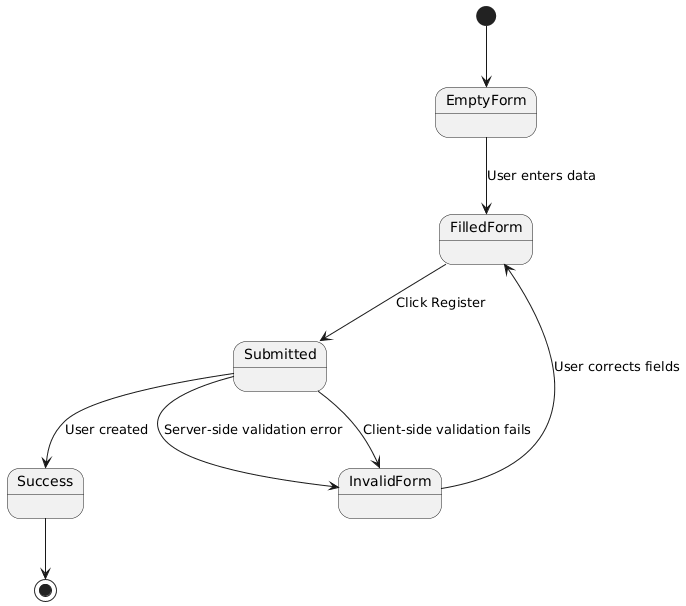
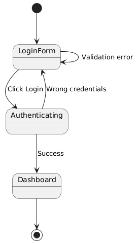
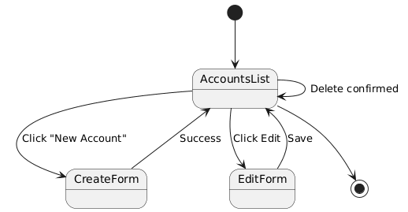
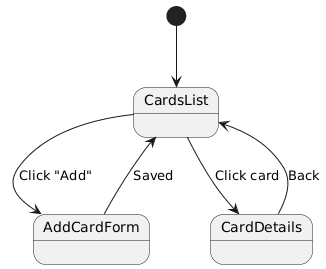
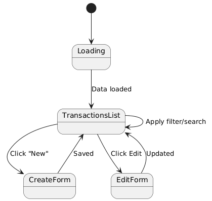

# State Diagrams for Binance

## UC1: Регистрация нового пользователя

## UC2: Вход в систему

## UC3: Просмотр и управление счетами

## UC4: Просмотр и управление кар: карты

## UC5: Просмотр и управление транзакциями

## UC6: Просмотр аналитики и статистики
